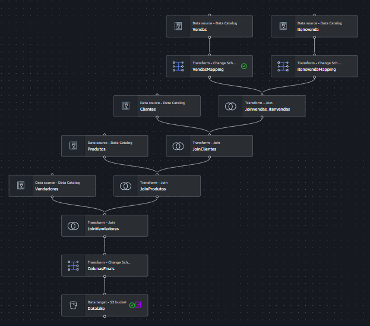

# Projeto: Pipeline de Data Lake e ETL com AWS (S3, Glue e Athena)

## 🎯 Objetivo do Projeto
Este projeto tem como objetivo a construção de um pipeline de dados (Data Lake) utilizando serviços da AWS. A finalidade foi realizar a ingestão de dados brutos (CSV), processamento e transformação (ETL) para um formato otimizado (Parquet) e disponibilização para análise via SQL no AWS Athena.

## 🏗️ Arquitetura do Pipeline
O fluxo de dados foi desenhado para seguir boas práticas de Engenharia de Dados:
1. **Ingestão (Raw):** Armazenamento dos arquivos .csv no AWS S3 (Bucket).
2. **Catalogação:** Utilização do AWS Glue Crawler para inferir o esquema das tabelas.
3. **Processamento (ETL):** Criação de um Job no AWS Glue para limpeza, renomeação de colunas, joins de tabelas e particionamento dos dados.
4. **Armazenamento Final (Curated):** Escrita dos dados processados no formato **Parquet** (colunar e otimizado).
5. **Consulta (Analytics):** Utilização do AWS Athena para realizar consultas SQL sobre a camada processada.

## 🛠️ Tecnologias Utilizadas
* **AWS S3:** Armazenamento de objetos (Data Lake).
* **AWS Glue:** Orquestração de ETL, Data Catalog e Crawlers.
* **AWS Athena:** Motor de consulta SQL em serverless.
* **AWS IAM:** Gestão de permissões e segurança.
* **Python/PySpark:** Linguagem utilizada nos scripts de transformação do Glue.

## 🚀 Desafios Técnicos Resolvidos
* **Limpeza de Dados:** Tratamento de conflitos de chaves estrangeiras através de renomeação estratégica de campos (sufixos).
* **Modelagem:** Remoção de campos desnecessários (IDs) para a camada de visualização final.
* **Otimização:** Conversão de CSV para Parquet, reduzindo o custo e aumentando a velocidade de consulta no Athena.
* **Organização:** Particionamento de dados por categoria de clientes (Silver, Gold e Platinum).

## 📊 Visualização do Job (Fluxo)


## 🔍 Exemplo de Consulta (Athena)
Os dados desnormalizados permitem consultas rápidas e intuitivas:
```sql
SELECT * FROM vendas_datalake.datalake 
WHERE estado = 'SC';
```

##📈 Resultados
O pipeline demonstrou a capacidade de transformar dados brutos não estruturados em informações prontas para análise de negócio, utilizando a escalabilidade da nuvem AWS.

**Projeto desenvolvido como parte do curso de Engenharia de Dados.**
